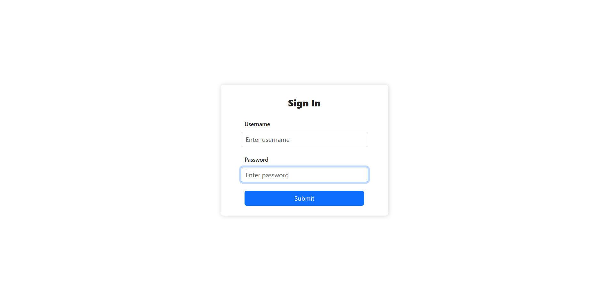
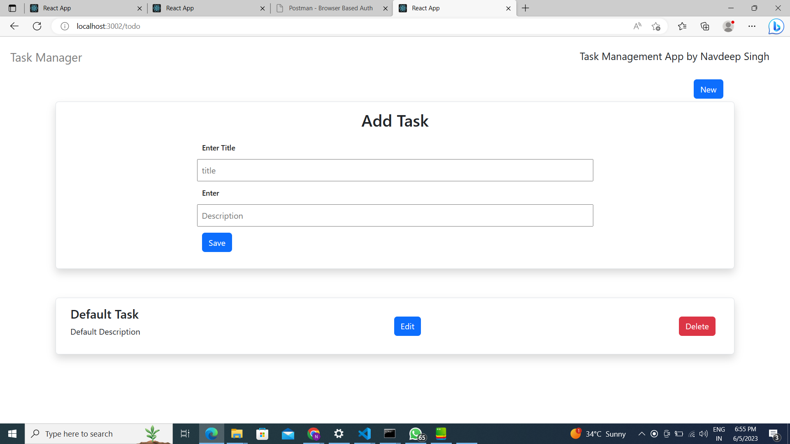

##  A task manager where user can create tasks and see his task 

- Redirect him to task dashboard section after login
- Use https://reqres.in/ api to authenticate user and redirect him to task manager
dashboard where he can see his task and create

# Login Screen

# After entering credentials

## Api used - https://reqres.in/api/login

## Correct credentials
 
 > "email": "eve.holt@reqres.in",
 >   "password": "cityslicka"